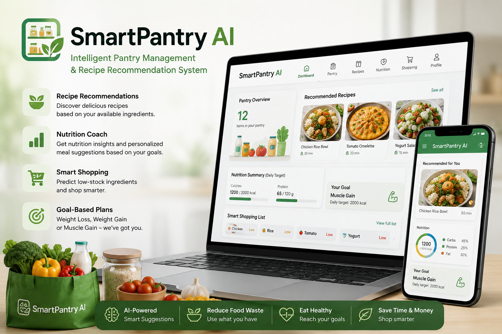

# 🍽️ SmartPantry AI

<p align="center">

<a href="https://www.python.org/" target="_blank">

</a>

<a href="https://pandas.pydata.org/" target="_blank">

</a>

<a href="https://scikit-learn.org/" target="_blank">

</a>

<a href="https://en.wikipedia.org/wiki/Tf%E2%80%93idf" target="_blank">

</a>

<a href="https://en.wikipedia.org/wiki/Artificial_intelligence" target="_blank">

</a>

<a href="https://www.kaggle.com/shahramsharif12" target="_blank">

</a>

</p>

---

<p align="center">

</p>

---

# 📌 Overview

SmartPantry AI is an intelligent pantry management and recipe recommendation system that helps users discover recipes using the ingredients they already have.

The project uses **Python**, **Pandas**, and **TF-IDF** to calculate ingredient similarity and recommend recipes efficiently.

Current prototype features include intelligent pantry management, recipe recommendation, and a scalable architecture for future AI enhancements.

---

# ✨ Features

- 🥫 Pantry Management
- 🍝 Recipe Recommendation
- 🧠 Ingredient Similarity using TF-IDF
- 📊 Nutrition-aware Meal Planning
- 🛒 Smart Shopping List (Future Version)

---

# 🛠 Technologies

- Python
- Pandas
- NumPy
- Scikit-Learn
- TF-IDF
- Jupyter Notebook

---

# 🚀 Installation

Clone the repository

```bash
git clone https://github.com/shahramsharif85/SmartPantry-AI.git
```

Install dependencies

```bash
pip install -r requirements.txt
```

Launch Jupyter Notebook

```bash
jupyter notebook
```

---

# ▶️ Usage

Open

```text
smartpantry-ai-mvp.ipynb
```

Run all notebook cells to:

- Load ingredient dataset
- Vectorize ingredients using TF-IDF
- Calculate ingredient similarity
- Generate recipe recommendations

---

# 📈 Results

The current prototype demonstrates that TF-IDF based ingredient similarity can effectively recommend recipes using available pantry items.

Current capabilities:

- Ingredient similarity search
- Recipe recommendation
- Pantry management prototype

---

# 🚀 Future Improvements

- Deep Learning recommendation engine
- Nutrition scoring
- Barcode Scanner
- User Authentication
- Mobile Application
- GPT-powered recipe generation

---

# 📂 Project Structure

```text
SmartPantry-AI/
│
├── README.md
├── LICENSE
├── requirements.txt
├── .gitignore
├── smartpantry-banner.png
├── smartpantry-ai-mvp.ipynb
```

---

# 📓 Kaggle Notebook

https://www.kaggle.com/code/shahramsharif12/smartpantry-ai-mvp

---

# 👨‍💻 Author

**Shahram Sharif**

AI • Machine Learning • Python

LinkedIn

https://www.linkedin.com/in/shahram-sharif-256419b8/

GitHub

https://github.com/shahramsharif85

---

# 📜 License

This project is released under the MIT License.

---

# ⭐ Support

If you found this project useful, consider giving it a ⭐ on GitHub.

Thank you for visiting SmartPantry AI!
